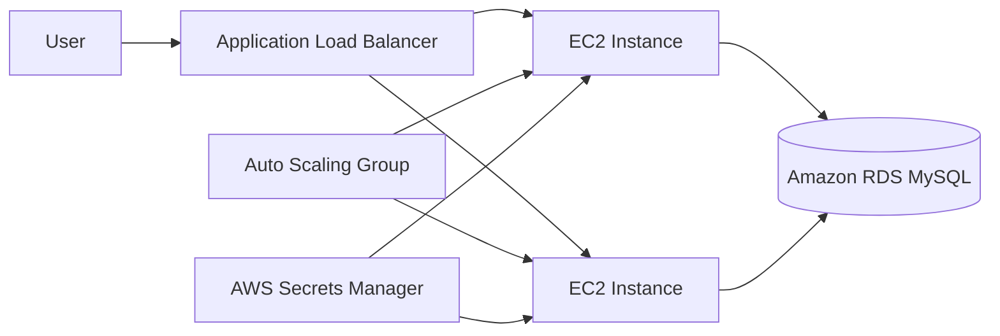

# Phonebook CloudFormation Project

A production-style phonebook web application built with **Python Flask**, **MySQL**, **Docker**, and **AWS CloudFormation**.

The project was first tested locally with Docker and then deployed to AWS using an Application Load Balancer, Auto Scaling, Amazon RDS, Nginx, and Gunicorn.

## Architecture



## Main Features

- Search phonebook contacts
- Add new contacts
- Update existing contacts
- Delete contacts
- MySQL persistent storage
- Application health endpoint at `/health`
- Nginx reverse proxy
- Gunicorn application server
- Application Load Balancer
- Auto Scaling Group
- Private Amazon RDS MySQL database
- AWS Secrets Manager for credentials
- AWS Systems Manager Session Manager access
- Infrastructure as Code with AWS CloudFormation

## Technologies

- Python
- Flask
- PyMySQL
- MySQL 8
- Docker Compose
- Gunicorn
- Nginx
- AWS CloudFormation
- Amazon EC2
- Amazon RDS
- Application Load Balancer
- EC2 Auto Scaling
- AWS Secrets Manager
- AWS Systems Manager
- Git and GitHub

## Project Structure

```text
phonebook-cloudformation-project/
├── app.py
├── init_db.py
├── requirements.txt
├── docker-compose.yml
├── .env.example
├── database/
│   └── init.sql
├── templates/
│   ├── index.html
│   ├── add-update.html
│   └── delete.html
├── infrastructure/
│   ├── stage1.yml
│   └── stage2.yml
└── screenshots/
    ├── website.png
    ├── targets-healthy.png
    └── cloudformation-complete.png
```

## Local Setup

Create a local environment file:

```powershell
Copy-Item .env.example .env
```

Update the values inside `.env`, then start MySQL:

```powershell
docker compose up -d
```

Create and activate a Python virtual environment:

```powershell
python -m venv venv
venv\Scripts\Activate.ps1
pip install -r requirements.txt
```

Initialize the database and start the Flask application:

```powershell
python init_db.py
python app.py
```

Open:

```text
http://127.0.0.1:5000
```

Health check:

```text
http://127.0.0.1:5000/health
```

## AWS Deployment

The project uses the AWS CLI profile `phonebook` and the `us-east-1` Region.

Validate the first template:

```powershell
aws cloudformation validate-template `
  --template-body file://infrastructure/stage1.yml `
  --profile phonebook
```

Deploy Stage 1:

```powershell
aws cloudformation deploy `
  --template-file infrastructure/stage1.yml `
  --stack-name phonebook-stage1 `
  --parameter-overrides `
    VpcId=<VPC_ID> `
    PublicSubnetId=<PUBLIC_SUBNET_ID> `
    DBSubnetIds="<SUBNET_ID_1>,<SUBNET_ID_2>" `
  --capabilities CAPABILITY_IAM `
  --profile phonebook
```

Stage 1 deploys one EC2 instance and one private RDS database.

Validate Stage 2:

```powershell
aws cloudformation validate-template `
  --template-body file://infrastructure/stage2.yml `
  --profile phonebook
```

Deploy Stage 2:

```powershell
aws cloudformation deploy `
  --template-file infrastructure/stage2.yml `
  --stack-name phonebook-stage1 `
  --parameter-overrides `
    VpcId=<VPC_ID> `
    PublicSubnetIds="<SUBNET_ID_1>,<SUBNET_ID_2>" `
  --capabilities CAPABILITY_IAM `
  --profile phonebook
```

Stage 2 adds:

- Application Load Balancer
- Target Group health checks
- Launch Template
- Auto Scaling Group
- CPU target tracking policy
- Two healthy EC2 application instances

## Screenshots

### Application


### Healthy Load Balancer Targets


### CloudFormation Deployment


## Cleanup

Delete all AWS resources created by the stack:

```powershell
aws cloudformation delete-stack `
  --stack-name phonebook-stage1 `
  --profile phonebook

aws cloudformation wait stack-delete-complete `
  --stack-name phonebook-stage1 `
  --profile phonebook
```

Stop the local MySQL container:

```powershell
docker compose down
```

## Author

**Yazen Albu**

- GitHub: [yazenAlbu](https://github.com/yazenAlbu)
- LinkedIn: [Yazen Albu](https://www.linkedin.com/in/yazen-albu)
